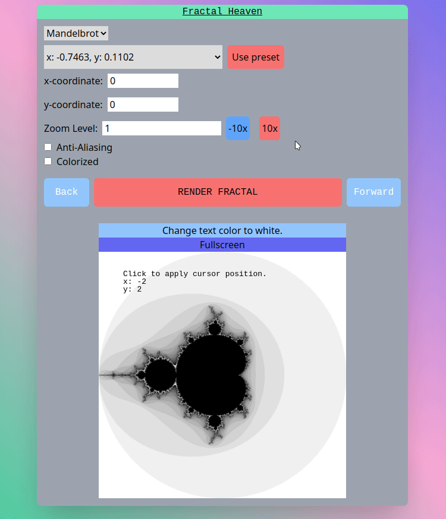
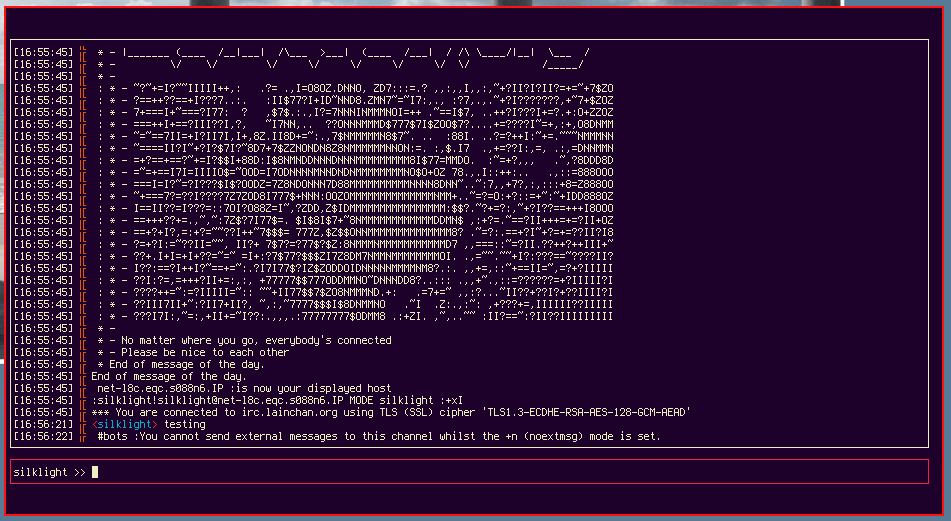

# Koa Calloway; *a highly comprehensive summary*

> "Welcome back my friends, to the show that never ends" - *Emerson, Lake & Palmer*

[Other inspiring quotes](relative/relative.md)

## About me
I am a passionate childlike innovator who flirts with ideas that enable mankind to take the next steps in \<insert corporate boilerplate of your choice\>. 

For webdev projects I like to work with React, TailwindCSS and Go.



Some examples: 
- A webapp for generating and exploring fractals.
- A webscraping backend I created last year for CSE194 to explore the prevalence of hate speech on an infamous imageboard(this project is not public on account of horrible optics).
- Web frontend + API endpoints for a Linux system boot-up observability tool I built during an internship.

I also enjoy creating TUI programs with Go.




I hope to work on backends, systems, and ops stuff after I graduate. While frontend work is enjoyable, I see it as a window to present what's going on behind the scenes, which is where the real fun happens. This is just my opinion and I don't think UI is any less important than lower-levels of the stack.


## Internship Experience 
Over the summer I was an intern at Keysight Technologies. Here are links to the projects I worked on:

## [spirit-box](https://github.com/keysight-kcos/spirit-box): Linux boot-up observability tool

Technologies used:
- Go
- systemd
- iptables
- React

## [kovenant](https://github.com/keysight-kcos/kovenant): Plug-and-play cluster-monitoring setup that combines higher-level metrics gathered via Prometheus with lower-level metrics gathered via Tetragon.

Technologies used:
- Kubernetes
- Helm
- eBPF/Tetragon
- Telegraf, InfluxDB, Grafana
- Prometheus

Other notes: 
- Worked with Agile/Jira
- Had experience creating and delivering presentations of these projects in front of audiences

## CODE QUOTE

I liked writing this method and think it's neat:
```
func (pg *PriorityGroup) RunAll() {
	// Init trackers
	now := time.Now()
	pg.Trackers = make([]*ScriptTracker, len(pg.Specs))
	for i, _ := range pg.Specs {
		pg.Trackers[i] = &ScriptTracker{
			StartTime: now,
			Runs:      make([]*ScriptResult, 0, 1000),
		}
	}

	var wg sync.WaitGroup
	for i, _ := range pg.Specs {
		wg.Add(1)
		go func(spec *ScriptSpec, tracker *ScriptTracker) {
			timer := time.NewTimer(time.Duration(spec.TotalWaitTime) * time.Millisecond)
			resChan := make(chan ScriptResult)
		RLoop:
			for {
				go func() {
					resChan <- spec.Run()
				}()
				select {
				case res := <-resChan:
					tracker.Runs = append(tracker.Runs, &res)
					if res.Success {
						break RLoop
					}
				case <-timer.C: // process took too long
					break RLoop
				}
				time.Sleep(time.Duration(spec.RetryTimeout) * time.Millisecond)
			}

			tracker.EndTime = time.Now()
			tracker.Finished = true

			go func(spec *ScriptSpec, tracker *ScriptTracker) { // logging
				scriptLog := NewScriptLogObj(spec, tracker)
				le := logging.NewLogEvent(scriptLog.LogLine(), scriptLog)
				le.StartTime = scriptLog.StartTime
				le.EndTime = scriptLog.EndTime
				le.Duration = scriptLog.EndTime.Sub(scriptLog.StartTime)
				logging.Logs.AddLogEvent(le)
			}(spec, tracker)

			wg.Done()
		}(pg.Specs[i], pg.Trackers[i])
	}
	wg.Wait()
}
```
Link to repo: [https://github.com/keysight-kcos/spirit-box](https://github.com/keysight-kcos/spirit-box)

## IMPORTANT LISTS

Other interests/hobbies:
- Guitar
- Reading
- Surfing

Favorite numbers:

1. 42 
2. 1337
3. 19

Life todos:
- [ ] Get degree
- [ ] Live a long and fulfilling life
- [ ] Die